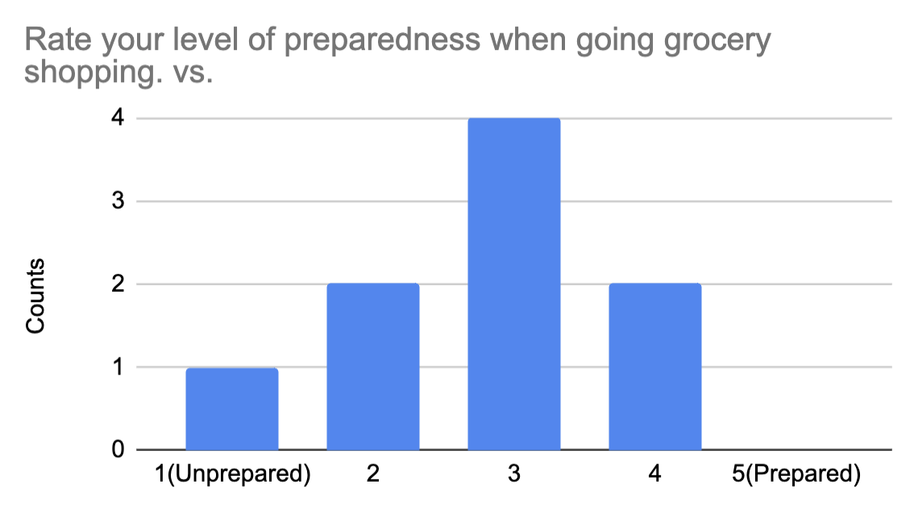
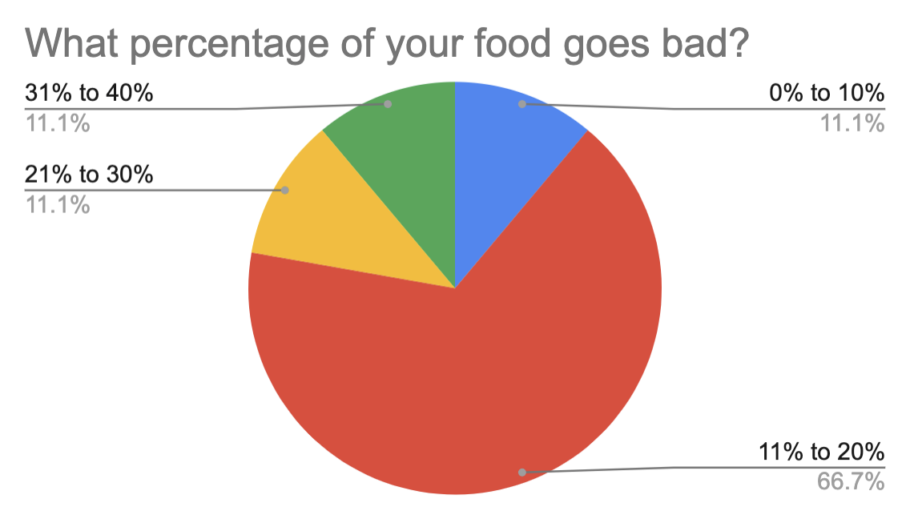
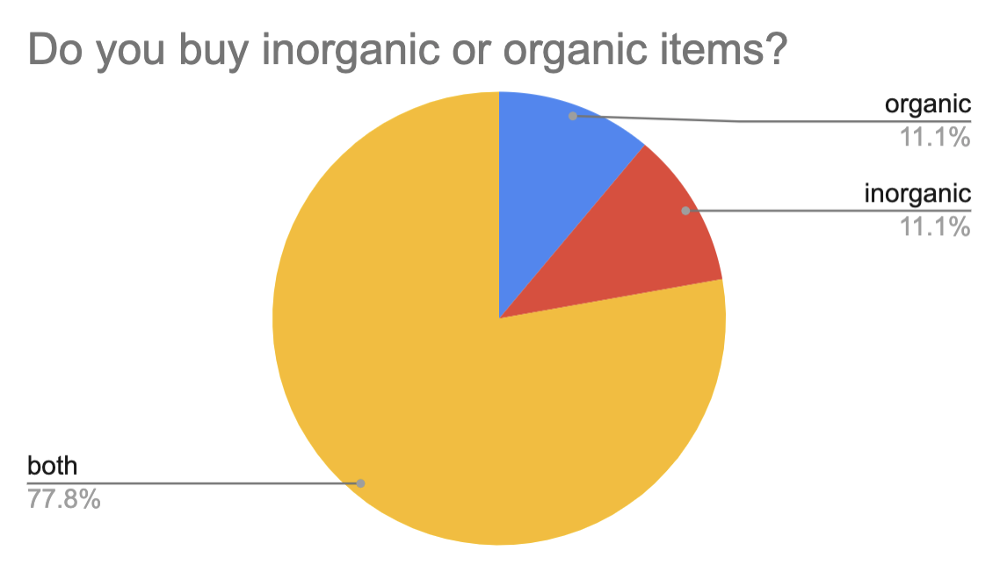
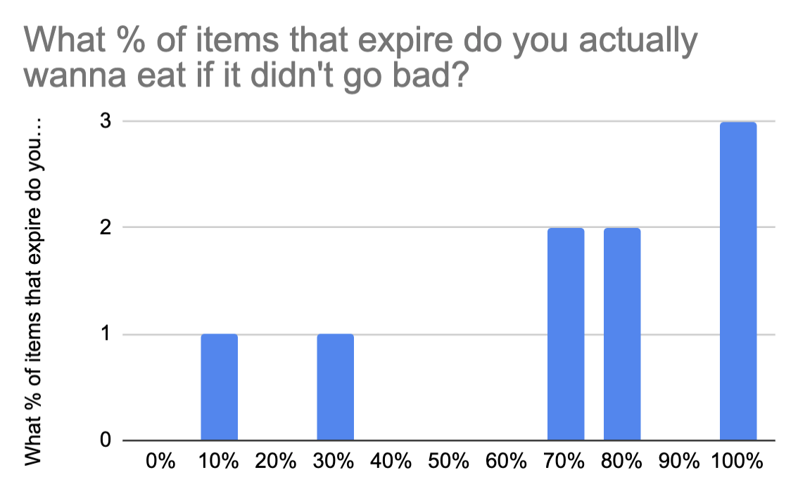
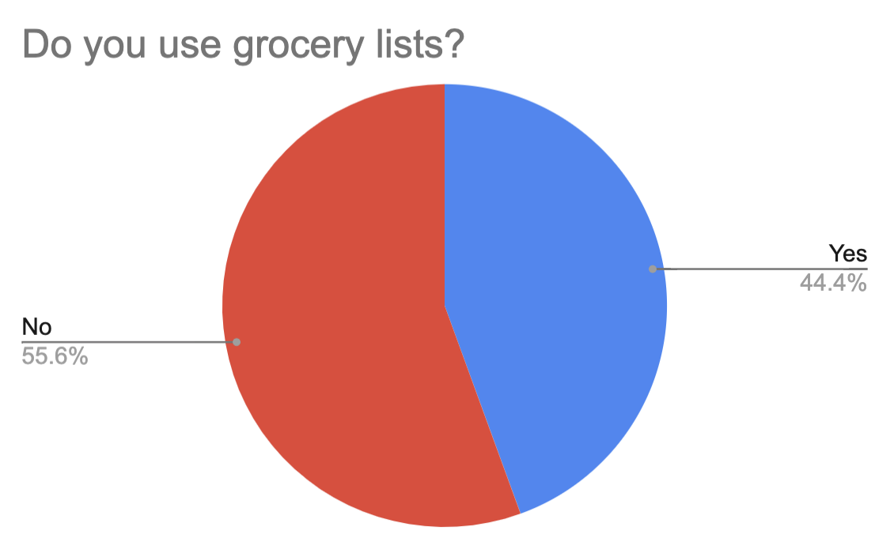
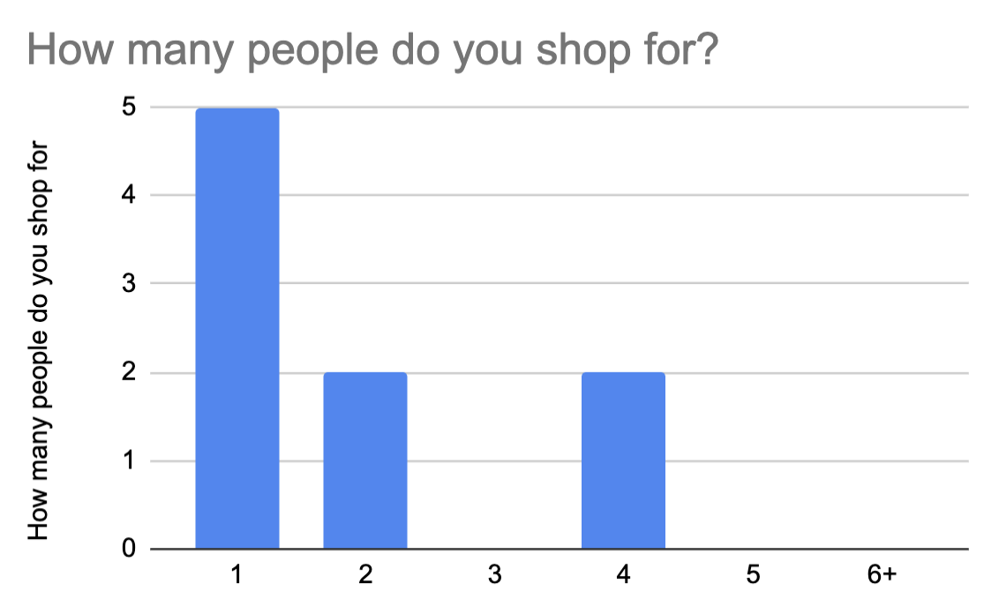
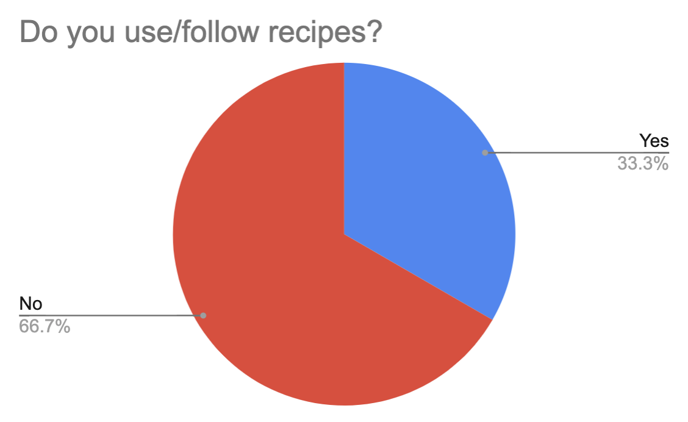
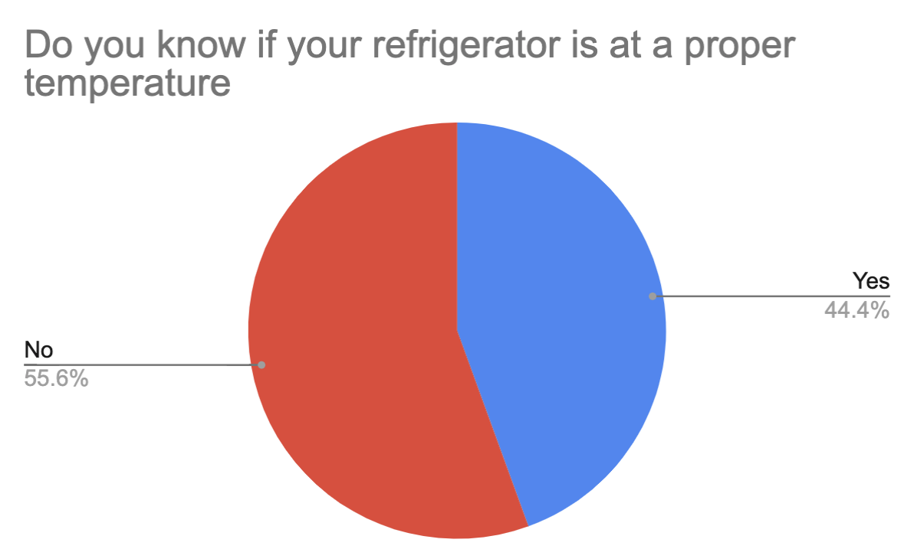
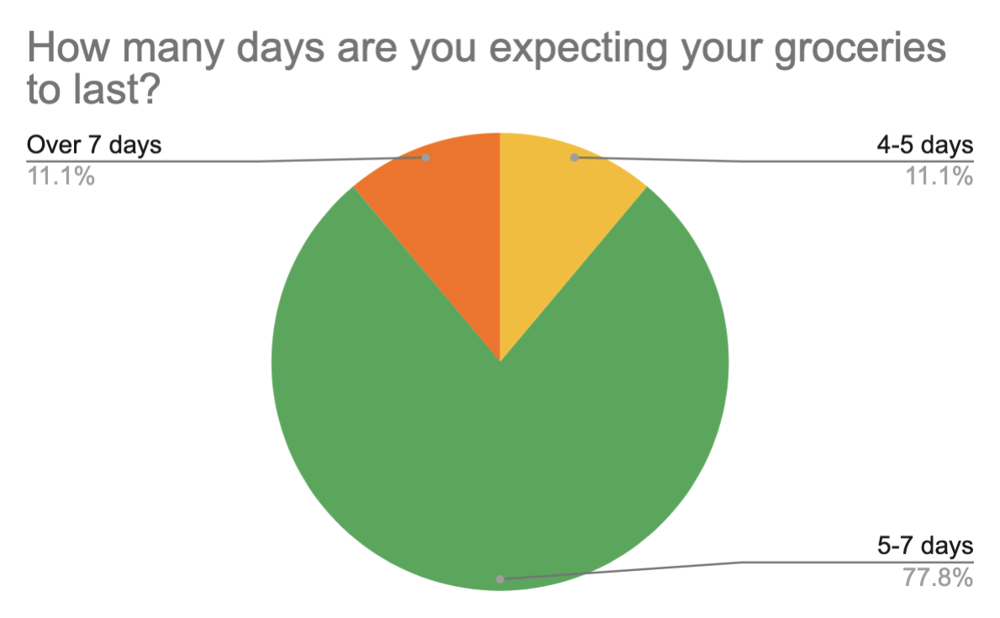
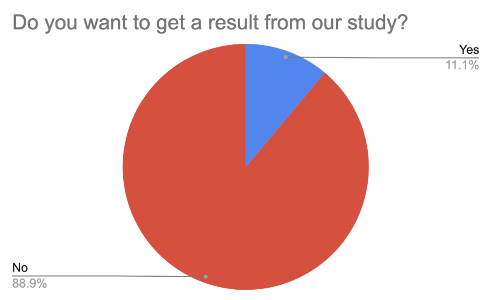

# Neomom, Phase 1: User Inquiry and Inspection

## Methods

Describe (A) Methods you used (B) Why you used them, and (C) Number of users (e.g. n=10) for each method

## Findings

For each method, describe the users you collected data from (demographics and how they represent your user base) and summarize the findings point-by-point (for example, the distribution of answers for a multiple-choice question). If you are researching existing software and/or competitor software, you may want to include pictures with call-outs that point out both important features and flaws within the interface.

* Over half of the participants tend to prepare when they go to grocery shopping.

* 66% of participants responded that 11% to 20% of their food goes bad. Almost all participants tend to *leave that some of their food goes bad.

* When almost all participants buy groceries, they don't care about them whether groceries are organic or not.

* Almost all participants want to eat expired foods if the foods didn't go bad.

* Over half of the participants don't use a grocery list.

* Almost all participants shop for a small group of families.

* 66% of participants don't use any recipes when they cooking.

* Over half of the participants don't know about their refrigerators are set at appropriate temperatures.

* 77% of participants expected their groceries will be used for 5-7 days. 

* Almost all participants don't want to get a result of our study.

In addition, we found some dairy products, fruits, or groceries are usually expired and responders usually buy these items. One-third of the participants are fellowing Carnivorous diets.  

## Conclusions

Discoveries derived from the method(s). For example, explain a requirement (e.g. “Task X needs to be accomplished with fewer steps. . . ”) based on a finding (e.g. “. . . because in our contextual inquiry, we found it was what the users did most often and complained about extraneous work needed to complete it”)

## Caveats

Considerations and/or limitations to the method(s) you chose and the findings/conclusions drawn from them. In other words, give warnings if there are limitations to your research such as not being able to find enough users of a particular demographic, the methods not being able to expose certain information, assumptions you made, etc.

Due to the COVID-19 outbreak, students were advised to stay indoors for the rest of the Spring 2020 semester. This also meant that human experiments are not allowed nor possible. As a result, we resorted to using mock data since it was the next best thing we had access to. 

## Personas

Provide each of your user personas, which represent (potential) users of your software; explain how you derived these personas from your user inquiry

## Scenarios

Identify the primary scenarios for your software and for each, include a description that explains who (of your personas) and what they want to do

## Supplementary Materials

Include link(s) or cop(ies) to your instrument(s) itself (questionnaire for a survey, protocol for an interview or contextual inquiry, etc)
